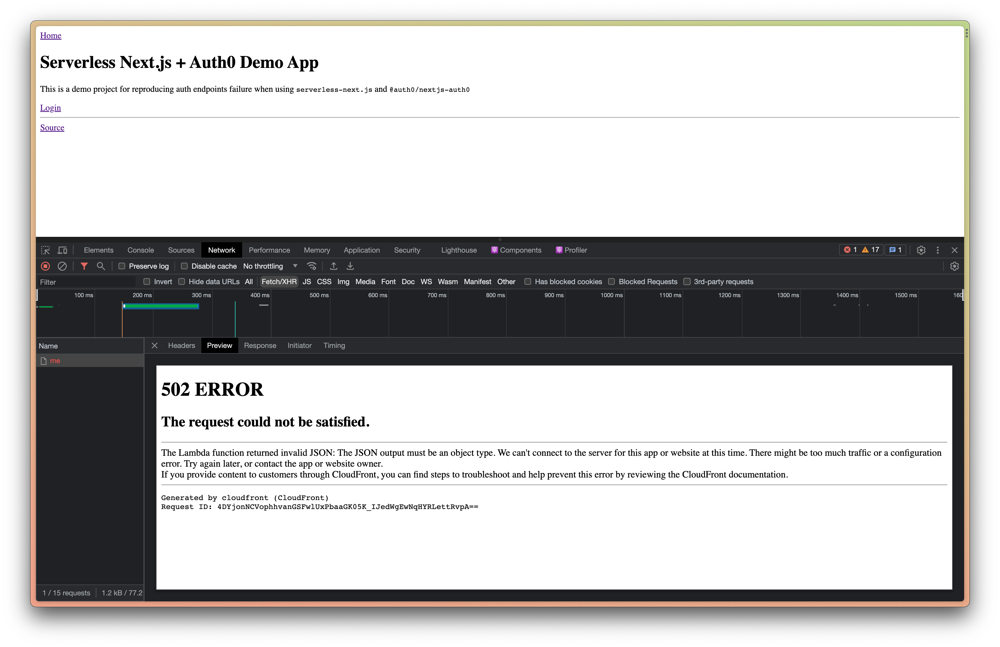
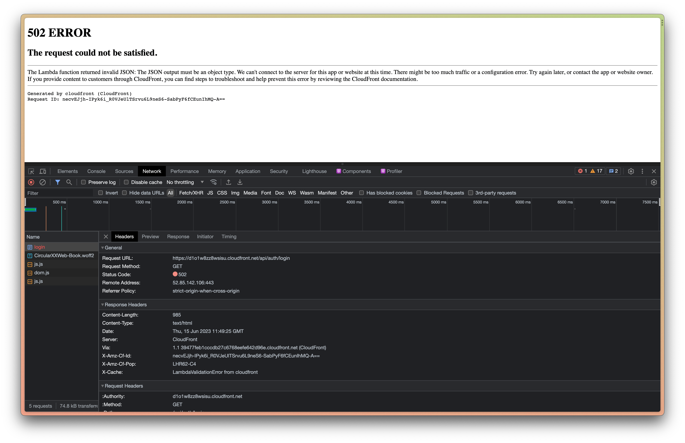

# Serverless Next.js + Auth0 Demo

This is an app for reproducing auth failures when using [`@auth0/nextjs-auth0`](https://github.com/auth0/nextjs-auth0) with [`serverless-next.js`](https://github.com/serverless-nextjs/serverless-next.js).

## Installation & setup

### Install dependencies
```bash
pnpm i
```

### Configure environment variables

**Create `.env` file**

```bash
cp .env.example .env
```

**Update environment variables in `.env`**

```bash
AUTH0_SECRET=<YOUR_AUTH0_SESSION_COOKIE_SECRET>
AUTH0_BASE_URL=http://localhost:3333
AUTH0_ISSUER_BASE_URL=<https://YOUR_AUTH0_TENANT.auth0.com>
AUTH0_CLIENT_ID=<YOUR_AUTH0_CLIENT_ID>
AUTH0_CLIENT_SECRET=<YOUR_AUTH0_CLIENT_SECRET>
```

**Add GitHub Action Secrets**

In addition to the environment variables listed above, add the following to your GitHub Action Secrets:

```bash
AWS_ACCESS_KEY_ID=<YOUR_AWS_ACCESS_KEY_ID>
AWS_SECRET_ACCESS_KEY=<YOUR_AWS_SECRET_ACCESS_KEY>
```

### AWS and serverless configs

**Create `serverless.yml` file**

```bash
cp serverless.yml.example serverless.yml
```

<details>
<summary>Create a user with the following policy</summary>

```json
{
    "Version": "2012-10-17",
    "Statement": {
        "Effect": "Allow",
        "Action": [
            "acm:DescribeCertificate",
            "acm:ListCertificates",
            "acm:RequestCertificate",
            "cloudfront:CreateCloudFrontOriginAccessIdentity",
            "cloudfront:CreateDistribution",
            "cloudfront:CreateInvalidation",
            "cloudfront:GetDistribution",
            "cloudfront:GetDistributionConfig",
            "cloudfront:ListCloudFrontOriginAccessIdentities",
            "cloudfront:ListDistributions",
            "cloudfront:ListDistributionsByLambdaFunction",
            "cloudfront:ListDistributionsByWebACLId",
            "cloudfront:ListFieldLevelEncryptionConfigs",
            "cloudfront:ListFieldLevelEncryptionProfiles",
            "cloudfront:ListInvalidations",
            "cloudfront:ListPublicKeys",
            "cloudfront:ListStreamingDistributions",
            "cloudfront:UpdateDistribution",
            "cloudfront:TagResource",
            "cloudfront:UntagResource",
            "cloudfront:ListTagsForResource",
            "iam:AttachRolePolicy",
            "iam:CreateRole",
            "iam:CreateServiceLinkedRole",
            "iam:GetRole",
            "iam:PutRolePolicy",
            "iam:PassRole",
            "lambda:CreateFunction",
            "lambda:EnableReplication",
            "lambda:DeleteFunction",
            "lambda:GetFunction",
            "lambda:GetFunctionConfiguration",
            "lambda:PublishVersion",
            "lambda:UpdateFunctionCode",
            "lambda:UpdateFunctionConfiguration",
            "lambda:ListTags",
            "lambda:TagResource",
            "lambda:UntagResource",
            "route53:ChangeResourceRecordSets",
            "route53:ListHostedZonesByName",
            "route53:ListResourceRecordSets",
            "s3:CreateBucket",
            "s3:GetAccelerateConfiguration",
            "s3:GetObject",
            "s3:ListBucket",
            "s3:PutAccelerateConfiguration",
            "s3:PutBucketPolicy",
            "s3:PutObject",
            "s3:PutBucketTagging",
            "s3:GetBucketTagging",
            "lambda:ListEventSourceMappings",
            "lambda:CreateEventSourceMapping",
            "iam:UpdateAssumeRolePolicy",
            "iam:DeleteRolePolicy",
            "sqs:CreateQueue",
            "sqs:DeleteQueue",
            "sqs:GetQueueAttributes",
            "sqs:SetQueueAttributes"
        ],
        "Resource": "*"
    }
}
```
</details>

- Grab the access key id and secret access key from Security details and set them in your GitHub Action Secrets

- Update `roleArn` and `policy` in `serverless.yml`

- CloudFront

  Create a new CloudFront distribution. Set the distribution id in `serverless.yml`.

- S3

  The serverless framework will create a S3 bucket for you when deploy. So all you need to do is to specify bucket name and region in the `serverless.yml`.

- Lambda

  The serverless framework will create Lambda(s) for you when deploy. You could change the name of the Lambda(s) in `serverless.yml`.

### Auth0

For Auth0 setup please refer to [`@auth0/nextjs-auth0`](https://github.com/auth0/nextjs-auth0).

## Deployment

This project uses GitHub Actions to make deployment to AWS. See `.github/workflows/deploy.yml` for more info.

## Issue

The Lambda function seems to always return 502 ERROR (LambdaValidationError from cloudfront) when calling auth endpoints such as `/api/auth/login`, `/api/auth/me`, etc provided by `@auth0/nextjs-auth0`.




